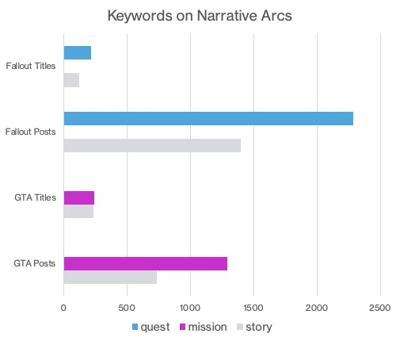

# Categorizing Subreddits Based on Topics

### Problem Statement
The goal of this project is to explore unstructured text data in two different video game subreddits in order to build a classification algorithm that can distinguish between the categories. Additionally, this project seeks to analyze trends in word usage to gain insight on the type of gamer (PC vs. Console), as well as the reasons why users post online (mods/DLCs, bugs/glitches, fan-fiction, etc.).

### Data Dictionary

|Feature|Type|Description|
|---|---|---|
|**timestamp**|*Time/Date*|Timestamp of post| 
|**author**|*Text*|Username of Reddit poster|
|**post_text**|*Text*|Text of Reddit post|
|**post_title**|*Text*|Title text of Reddit post|
|**category**|*Text*|r/Fallout or r/GTAV|
|**word_count**|*Integer*|Number of words in post|

### Summary
First, data was collected from the subreddit pages r/GrandTheftAutoV and r/Fallout using Pushshift's API. I scraped a total of 20,000 posts from both threads, but after dropping duplicates and empty posts, the samples were reduced to 8,500 observations for Grand Theft Auto and 13,000 for Fallout. After instantiating a CountVectorizer function to pre-process the post text, I immediately began looking for keywords that would distinguish between the videogames. One set of terms that stood out was the way the story arcs were described. Reddit users referred to Fallout storylines as "quests" whereas in Grand Theft Auto they were called "missions". Similarly, I grouped the most frequently occurring words in both subreddit posts and title text fields. For Fallout, these were: Vault, World, Armor, Character, Brotherhood, Wasteland, and Faction. In Grand Theft Auto, they were Car, Rockstar, Money, Epic, Club, Casino and Crew. 
 
Then, I tagged and aggregated the word count of terms associated with common video game topics such as Bugs/Glitches, Mods and DLCs, PC vs. Console, and Fan Fiction. While Fallout gamers were more likely to discuss mods and bugs, Grand Theft Auto fans preferred to talk about action sequences and other in-game experiences. Grand Theft Auto fans were also more likely to play the game online or on a PC, whereas Fallout gamers favored a console such as Xbox or PS4. After completing my exploratory data analysis, I set the final parameters of the CountVectorizer transformer. In order to qualify as a feature in a machine learning model, words had to appear in at least two posts, but no more than 80% of all posts. I then set a cap of 14,000 words total between both subreddits so as not to overload my computer's processor. 
 
Next, I ran a Grid-Search Cross Validation on multiple estimators (Naive Bayes, Random Forest, and Logistic Regression) to find the optimal hyperparameters for each model. Multinomial Naive Bayes scored the highest with an accuracy score of .97 on training data and a .96 on testing data. Random Forest was a close second, with an accuracy score of .90 on training data and .89 on testing data.

### Conclusions and Recommendations
In summary, I think this machine learning model could have benefited from better lemmatization/stemming in the pre-processing phase. I encountered several duplicate word forms late into the modeling process and tried to correct them manually where possible. Also, I didn't extract any combination of word pairings or groupings for additional context. Filtering the corpus by 2- or 3-word tokens could have provided valuable insight. Finally, I would have liked to test a few other models such as Support Vector Machines or Boosted Decision Trees, though the previously discussed algorithms scored well enough on their own.